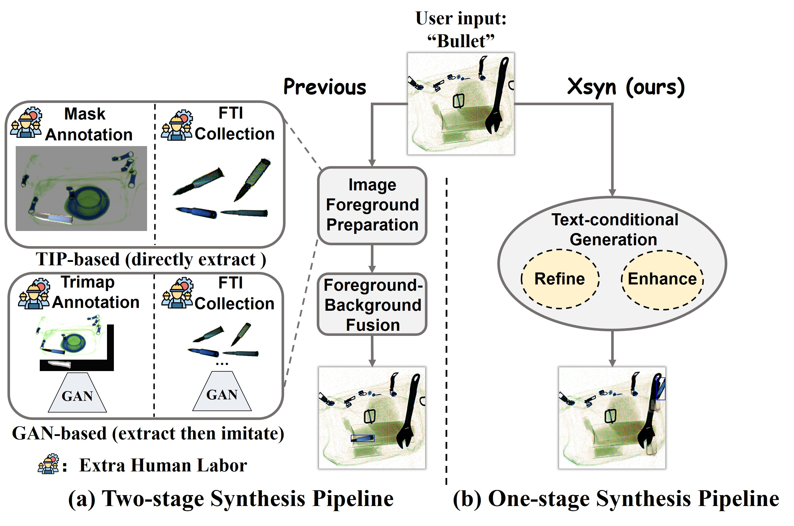

# Taming Generative Synthetic Data for X-ray Prohibited Item Detection

[[Paper](https://arxiv.org/abs/2511.15299)]

<figure style="display:block; text-align:center; margin:0 auto;">
  
</figure>

- We propose Xsyn, a simple and effective one-stage
 synthesis pipeline in the X-ray security domain. To the
 best of our knowledge, Xsyn is the first to achieve high
quality X-ray security image synthesis without incurring
 additional labor-intensive foreground preparation.

## Requirements
- Enviroment: We provide [enviroment.yml](environment.yml) to setup enviroment.
- Data: [PIDray](https://github.com/lutao2021/PIDray), [OPIXray](https://github.com/DIG-Beihang/OPIXray) and [HiXray](https://github.com/HiXray-author/HiXray/blob/main/README.md). 

## Download Xsyn models

We will provide checkpoints for different datasets. All models here are based on GLIGEN.
| Dataset       | Mode       | Download                                                                                                       |
|------------|----------------|----------------------------------------------------------------------------------------------------------------|
| PIDray | text-grounded inpainting       | [HF Hub](https://huggingface.co/Pillow-1/Xsyn)       |
| OPIXray | text-grounded inpainting | [HF Hub](https://huggingface.co/Pillow-1/Xsyn) |
| HiXray | text-grounded inpainting       | [HF Hub](https://huggingface.co/Pillow-1/Xsyn)       |

## Training
Please follow the instruction of text-grounded inpainting training in [GLIGEN](https://github.com/gligen/GLIGEN).

## Inference
We provide one script to generate x-ray security images and construct their annotations. First download models and put them in `--ckpt_path`. Then run
```bash
python gligen_inference.py
```

Details of some important args:

- `--output_path`: the path to save your generated x-ray security images
- `--annotation_path`: the path to save the refined annotation(stored in txt format)
- `--vis_path`: the path to save visualization compared with gt
- `--ca_vis_path`: the path to save cross-attention maps
- `--image_path`: the path to load images you want to inpaint
- `--ckpt_path`: the generation model checkpoint path
- `--gligen_caption_pt`: the file to prepare your training/test data in [GLIGEN](https://github.com/gligen/GLIGEN) format
- `--gen_method`: set to 1 for Xsyn-M and 3 for Xsyn-A
- `--refine_anno`: set to True for `CAR`
- `--latent_redist`: set to True for `BOM`

After inference, we use `downstream_test.sh` to test the performance of our sythetic data. Our downstream detection environment is [mmdetection](https://github.com/open-mmlab/mmdetection).

## 🙏 Acknowledgment
This work is implemented based on [GLIGEN](https://github.com/gligen/GLIGEN). We greatly appreciate their valuable contributions to the community.